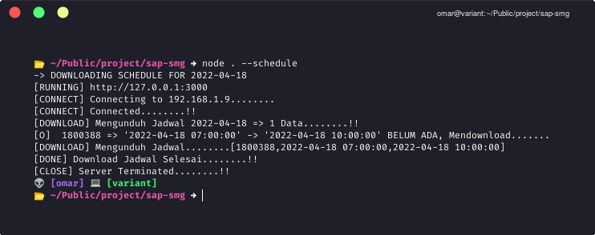
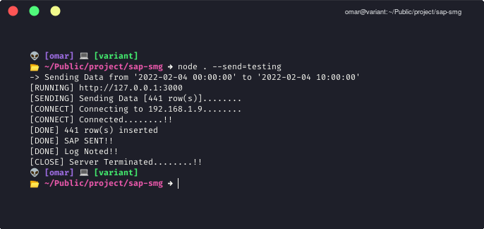

# SAP App

> Nodejs App for sending SAP Data to Indofood Semarang
>> Bundle Nodejs App to .exe application (or executable app)

## _Packages_
* `express` _for server instance_
* `mssql` _for mssql service_
* `pg` _for postgresql service_
* `pkg` _for bundling nodejs app to exe_

## _Features_
* `Downloading Schedule` _Download Schedule for Analyzing Employee Attendances_
* `Sending SAP Data` _Send SAP Data in several period of time_

## _Usage_
How to use
* `yarn install` _Installing Depencencies and Packages_
* `yarn bundle` _Bundling Nodejs App to .exe file_

## _Params_
Add these parameter to use the features
* `default / no params` _Run nodejs server, usually for sending SAP Manually_
* `--schedule` _Download Employee Schedule in current day_
* `--send=1000` _Send SAP Data from 10:00,Yesterday to 00:00 Today_
* `--send=0010` _Send SAP Data from 00:00,Today to 10:00 Today_
* `--send=manual` _Sending SAP Manually_

## _Screenshots_
* __Download Schedule__

* __Send SAP__

### _Notes_
_Because the target of installation is Windows Server 2008, so i used Nodejs 12.20.0 (yep, it works properly, and still support ES6)_